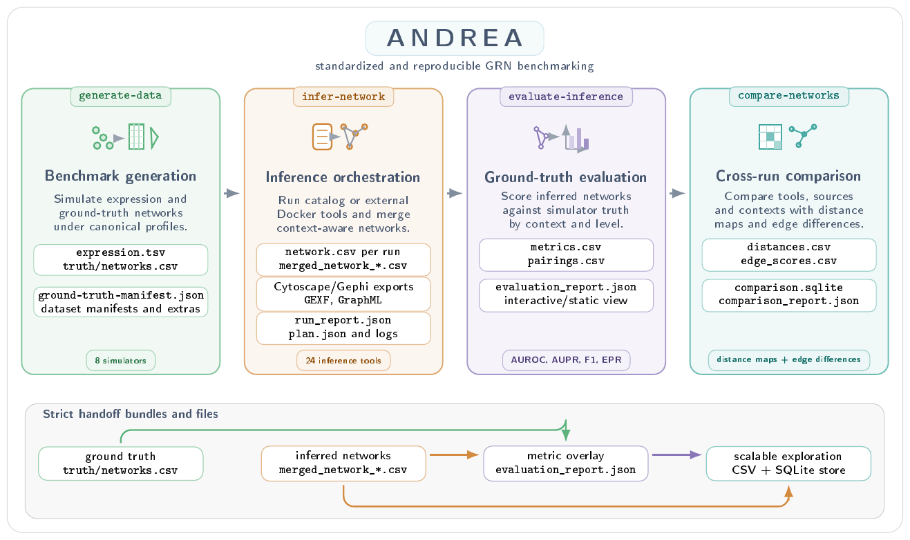

# ANDREA

**Automated Network Discovery, Reproducible Evaluation and Analysis**

ANDREA is a catalog-driven platform for generating benchmark expression
datasets, running gene regulatory network (GRN) inference tools, evaluating
inferred networks against reference truth and comparing networks across tools,
contexts and runs. It exposes the same workflows through a command-line
interface and local browser GUIs, while keeping public artifacts as plain JSON,
CSV, SQLite and ZIP files.

<p align="center">
  
</p>

## What ANDREA Provides

- A standardized catalog of simulator and inference-tool integrations, with
  compatibility rules, parameter schemas, Docker wrappers and provenance
  metadata.
- Four interoperable workflows:
  `generate-data -> infer-network -> evaluate-inference -> compare-networks`.
- Strict handoff bundles so outputs from one command can be consumed directly
  by the next one.
- Context-aware handling of global, group-level and column-level network
  outputs, including emulated and aggregated execution strategies where
  appropriate.
- Cost-aware planning and execution orchestration for Dockerized simulator and
  inference wrappers.
- Evaluation reports and interactive comparison views for distance maps,
  metric overlays and edge-level differences.
- Support for temporary external Docker inference tools that follow ANDREA's
  standard container contract.

## Installation

Install the release package:

```sh
pip install ANDREA
```

For a development checkout:

```sh
git clone https://github.com/AdrianSeguraOrtiz/ANDREA.git
cd ANDREA
python -m pip install -e ".[dev]"
```

Docker is required for workflows that execute simulator or inference wrappers.
See [docs/installation.md](docs/installation.md) for the full setup notes.

## Quick Start

Inspect the CLI:

```sh
andrea --help
andrea generate-data --help
andrea infer-network --help
andrea evaluate-inference --help
andrea compare-networks --help
```

Open the local GUIs:

```sh
andrea gui generate-data
andrea gui infer-network
andrea gui evaluate-inference
andrea gui compare-networks
```

The GUIs are local browser applications. ZIP bundles are mainly intended for
GUI handoff; CLI and Python users can usually pass report JSON paths directly.

## Workflows

| Command | Purpose | Key outputs |
|---|---|---|
| `generate-data` | Build synthetic benchmark datasets from simulator catalogs. | `expression.tsv`, `truth/networks.csv`, manifests and analysis bundles. |
| `infer-network` | Run catalog or external Docker inference tools against standardized datasets. | Per-run networks, merged normalized networks, graph exports and run reports. |
| `evaluate-inference` | Score inferred networks against simulator or user-provided truth. | Metric tables, pairing tables, `evaluation_report.json` and visual summaries. |
| `compare-networks` | Compare networks across tools, sources, parameters and contexts. | Distance tables, coordinates, `comparison.sqlite`, edge differences and reports. |

See [docs/workflows.md](docs/workflows.md) for the workflow contracts and
[docs/gui.md](docs/gui.md), [docs/cli.md](docs/cli.md) and
[docs/core.md](docs/core.md) for GUI, command-line and Python usage.

## Documentation

- [Installation](docs/installation.md)
- [Workflow contracts](docs/workflows.md)
- [GUI guide](docs/gui.md)
- [CLI guide](docs/cli.md)
- [Core Python guide](docs/core.md)
- [Catalogs and coverage](docs/catalogs.md)
- [External Docker tools](docs/external-docker-tools.md)
- [Full documentation index](docs/README.md)
