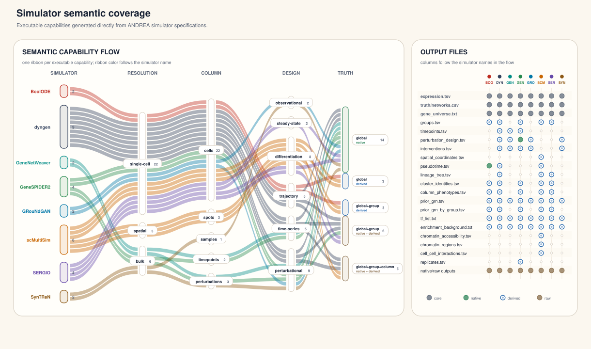
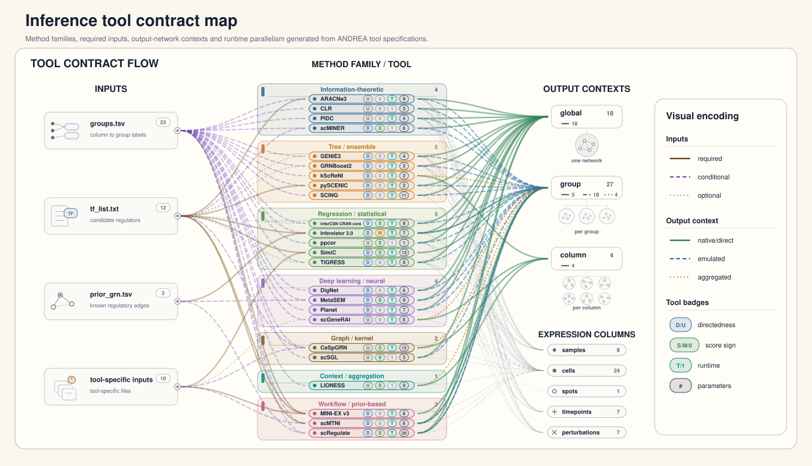

<!-- Generated by scripts/render_doc_assets.py. Do not edit manually. -->

# Catalogs And Coverage

ANDREA catalogs describe what each simulator or inference tool can do before
any expensive execution is launched. Specs are versioned JSON files and are
validated independently from wrapper runtime tests.

| Catalog | Entries | Executable coverage entries | Source specs |
|---|---:|---:|---|
| Simulation data tools | 8 | 31 capabilities | `simulatorspec.json` |
| Inference tools | 24 | 49 execution modes | `toolspec.json` |

## Simulators

Simulator specs live under
`andrea/catalog_simulation_data_tools/simulators/<simulator>/simulatorspec.json`.
They describe publication metadata, semantic data axes, native and derived
outputs, extra inputs, parameters, runtime resources and compatibility rules.

| Simulator | Capabilities | Data axes covered | Publication |
|---|---:|---|---|
| BoolODE | 2 | rna_expression/single_cell/cells/trajectory | https://doi.org/10.1038/s41592-019-0690-6 |
| dyngen | 9 | rna_expression/single_cell/cells/trajectory, rna_expression/single_cell/cells/time_series, rna_expression/single_cell/cells/perturbational | https://doi.org/10.1038/s41467-021-24152-2 |
| GeneNetWeaver | 2 | rna_expression/bulk/perturbations/perturbational, rna_expression/bulk/timepoints/time_series | https://doi.org/10.1093/bioinformatics/btr373 |
| GeneSPIDER2 | 4 | rna_expression/bulk/perturbations/perturbational, rna_expression/bulk/timepoints/time_series, rna_expression/single_cell/cells/perturbational | https://doi.org/10.1093/nargab/lqae121, https://doi.org/10.1039/c7mb00058h |
| GRouNdGAN | 2 | rna_expression/single_cell/cells/observational, rna_expression/single_cell/cells/perturbational | https://doi.org/10.1038/s41467-024-48516-6, https://doi.org/10.5281/zenodo.11068246 |
| scMultiSim | 6 | rna_expression/single_cell/cells/differentiation, rna_expression/spatial/spots/differentiation | https://doi.org/10.1038/s41592-025-02651-0, https://doi.org/10.18129/B9.bioc.scMultiSim |
| SERGIO | 4 | rna_expression/single_cell/cells/steady_state, rna_expression/single_cell/cells/differentiation | https://doi.org/10.1016/j.cels.2020.08.003 |
| SynTReN | 2 | rna_expression/bulk/samples/observational, rna_expression/bulk/perturbations/perturbational | https://doi.org/10.1186/1471-2105-7-43 |

## Inference Tools

Inference specs live under
`andrea/catalog_inference_tools/tools/<tool>/toolspec.json`. They describe
publication metadata, execution capabilities, accepted input semantics,
extra inputs, output semantics, parameters, runtime resources and
compatibility rules.
The figure groups the primary integrated algorithm by the reviewed
`method_family` field. Context, prior knowledge and workflow composition
are separate attributes; this grouping does not assert that methods
within a family are identical. Integration decision logs cite sources.

| Tool | Primary method family | Execution modes | Output semantics | Publication |
|---|---|---|---|---|
| ARACNe3 | information | `global`, `group_emulated` | directed=False, sign=none, evidence=association | https://doi.org/10.1186/1471-2105-7-S1-S7, https://doi.org/10.1093/bioinformatics/btw216 |
| CeSpGRN | graph | `column_native`, `group_aggregated` | directed=False, sign=signed, evidence=association | https://doi.org/10.1093/bioinformatics/btag324, https://doi.org/10.1101/2022.03.03.482887 |
| CLR | information | `global`, `group_emulated` | directed=False, sign=none, evidence=association | https://doi.org/10.1371/journal.pbio.0050008, https://doi.org/10.1186/1471-2105-9-461 |
| DigNet | neural | `global`, `group_emulated` | directed=True, sign=none, evidence=association | https://doi.org/10.1101/gr.279551.124 |
| GENIE3 | tree | `global`, `group_emulated` | directed=True, sign=none, evidence=association | https://doi.org/10.1371/journal.pone.0012776 |
| GRNBoost2 | tree | `global`, `group_emulated` | directed=True, sign=none, evidence=association | https://doi.org/10.1093/bioinformatics/bty916 |
| inferCSN CRAN core | regression | `global`, `group_emulated` | directed=True, sign=signed, evidence=association | https://doi.org/10.1038/s41540-025-00564-4 |
| Inferelator 3.0 | regression | `global`, `group_native`, `group_emulated` | directed=True, sign=mixed, evidence=association | https://doi.org/10.1093/bioinformatics/btac117, https://doi.org/10.1093/bioinformatics/btt099, https://doi.org/10.1186/gb-2006-7-5-r36 |
| kScReNI | tree | `column_native`, `group_aggregated` | directed=True, sign=none, evidence=association | https://doi.org/10.1093/gpbjnl/qzaf060 |
| LIONESS | correlation | `column_native`, `group_aggregated` | directed=False, sign=signed, evidence=association | https://doi.org/10.1016/j.isci.2019.03.021 |
| MetaSEM | neural | `global`, `group_emulated` | directed=True, sign=signed, evidence=association | https://doi.org/10.3390/ijms24032595 |
| MINI-EX v3 | tree | `group_native` | directed=True, sign=none, evidence=association | https://doi.org/10.1016/j.molp.2022.10.016, https://doi.org/10.1007/978-1-0716-4972-5_12 |
| PIDC | information | `global`, `group_emulated` | directed=False, sign=none, evidence=association | https://doi.org/10.1016/j.cels.2017.08.014 |
| Planet | neural | `global`, `group_emulated` | directed=True, sign=none, evidence=association | https://doi.org/10.3390/genes16111255 |
| ppcor | correlation | `global`, `group_emulated` | directed=False, sign=signed, evidence=association | https://doi.org/10.5351/CSAM.2015.22.6.665, https://doi.org/10.32614/CRAN.package.ppcor |
| pySCENIC GRN step | tree | `global`, `group_emulated` | directed=True, sign=none, evidence=association | https://doi.org/10.1038/s41596-020-0336-2, https://doi.org/10.1038/nmeth.4463 |
| scGeneRAI | neural | `column_native`, `group_aggregated` | directed=False, sign=none, evidence=association | https://doi.org/10.1093/nar/gkac1212 |
| SCING | tree | `global`, `group_emulated` | directed=True, sign=none, evidence=association | https://doi.org/10.1016/j.isci.2023.107124, https://doi.org/10.1101/2022.09.07.506959 |
| scMINER | information | `global`, `group_emulated` | directed=True, sign=mixed, evidence=association | https://doi.org/10.1038/s41467-025-59620-6, https://doi.org/10.1093/bioinformatics/bty907 |
| scMTNI | graph | `global`, `group_native`, `group_emulated` | directed=True, sign=signed, evidence=association | https://doi.org/10.1038/s41467-023-38637-9 |
| scRegulate | neural | `global`, `group_native`, `group_emulated` | directed=True, sign=signed, evidence=association | https://doi.org/10.1093/bioinformatics/btaf638 |
| scSGL | graph | `global`, `group_emulated` | directed=False, sign=signed, evidence=association | https://doi.org/10.1093/bioinformatics/btac288 |
| SimiC | regression | `group_native` | directed=True, sign=signed, evidence=association | https://doi.org/10.1038/s42003-022-03319-7 |
| TIGRESS | regression | `global`, `group_emulated` | directed=True, sign=none, evidence=association | https://doi.org/10.1186/1752-0509-6-145 |

## Maintenance

This page and its figures are generated from tracked catalog and input specs.
They do not depend on cost profiles or ignored workspaces. Regeneration
instructions are kept in [development.md](development.md).
