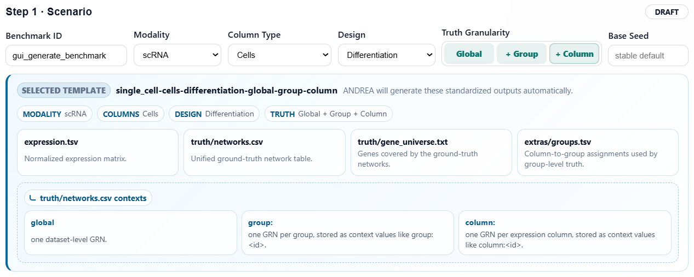
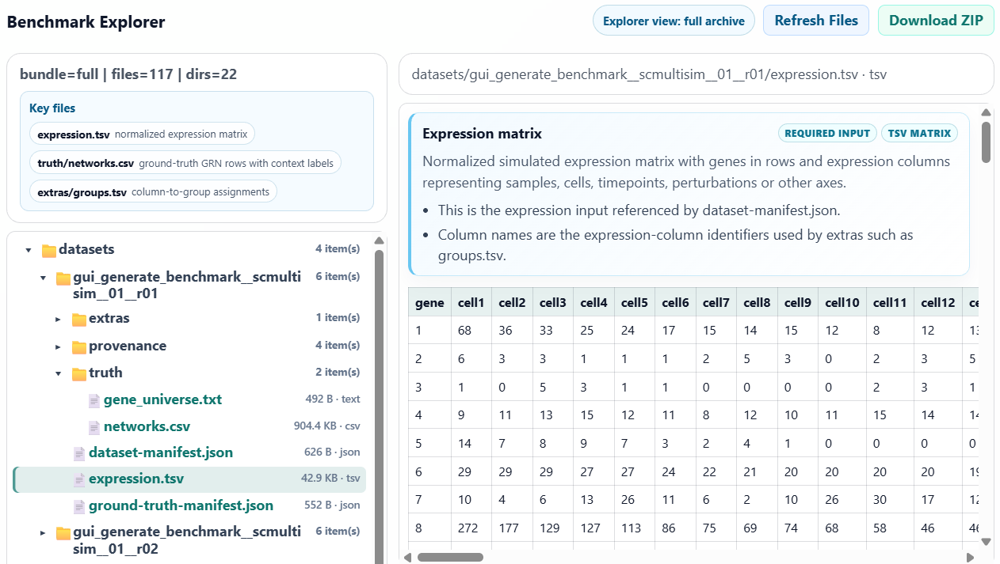
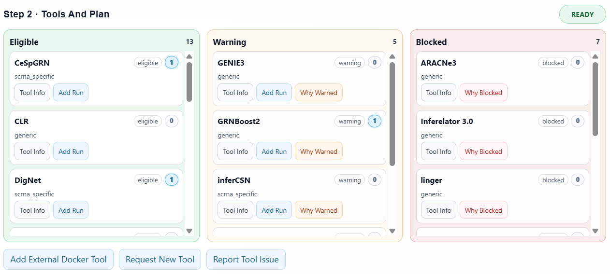
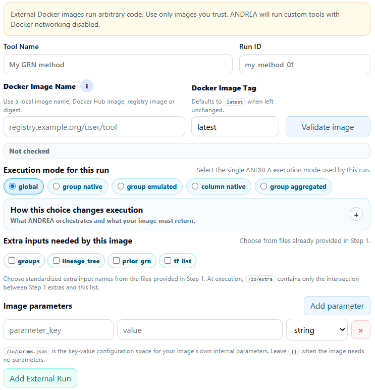
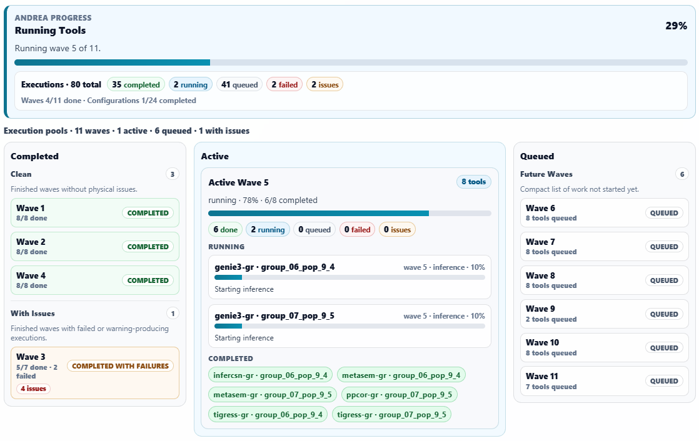
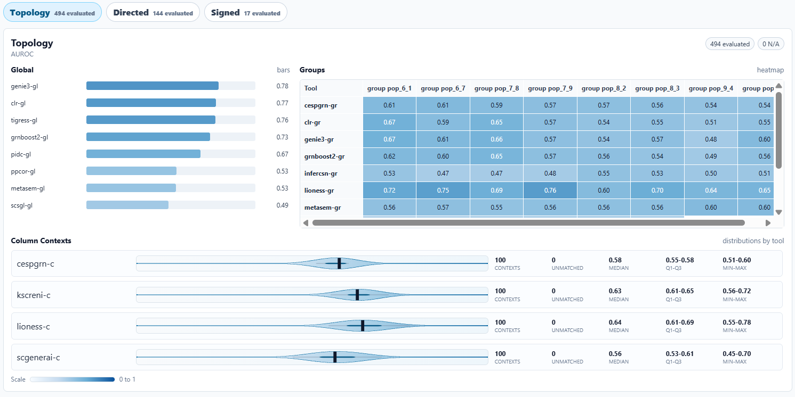
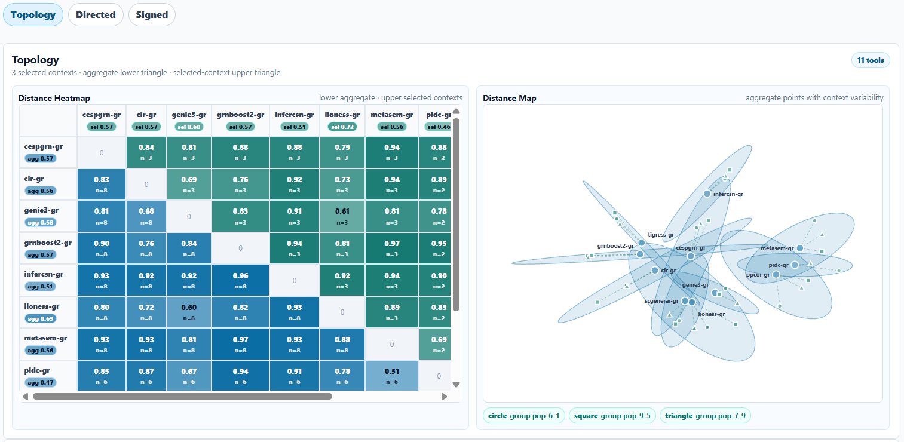
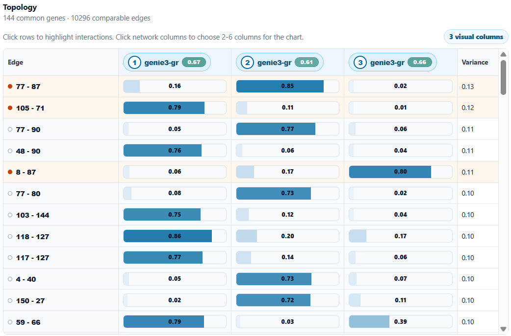
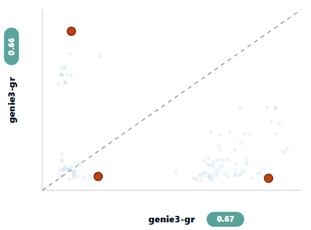
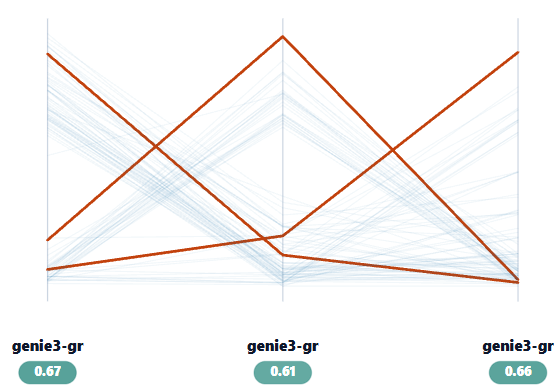

# GUI Guide

ANDREA provides four local browser GUIs, one for each workflow stage:

```sh
andrea gui generate-data
andrea gui infer-network
andrea gui evaluate-inference
andrea gui compare-networks
```

Each GUI writes the same public artifacts as the CLI and exposes reproducibility
snippets for command-line and Python use. The browser interface is intended for
interactive setup, inspection and handoff; the generated files remain normal
JSON, CSV, SQLite, graph and ZIP artifacts.

ZIP bundles are mainly for GUI-to-GUI handoff. CLI and Python users can usually
pass report JSON paths directly, as described in [Workflow contracts](workflows.md)
and [CLI guide](cli.md).

## Generate Data GUI

Launch:

```sh
andrea gui generate-data
```

The generate-data GUI guides the user from a benchmark scenario to a generated
dataset package.

### Step 1: Scenario

The first step defines what kind of expression benchmark should be generated.
The GUI collects the scenario identifier, organism metadata, data axes,
ground-truth requirements, optional standardized extras and any user-provided
input files required by the selected scenario.



The interface validates file presence and schema compatibility before the user
moves on. Requested extras are normalized into the set of effective extras that
can be produced, derived or carried through for downstream commands.

### Step 2: Simulators And Plan

After the scenario is known, ANDREA filters the simulator catalog into
`eligible`, `warning` and `blocked` groups. The cards summarize simulator
metadata, semantic capability and run counts already added to the selected
execution list.

The user can add individual simulator runs, add all eligible entries, configure
replicates, edit run IDs, tune parameters and select native outputs. The same
screen includes actions to request a new simulator or report a simulator issue
with the current GUI context.

Planning resolves simulator parameters, validates requested native outputs,
estimates resources from cost profiles or fallbacks and writes a
`simulation-plan.json`. The plan is split into executable tasks and waves so
parallelism respects CPU, RAM and task limits.

### Step 3: Execution And Results

During execution, the GUI polls per-simulator progress and the server job
payload. When datasets are available, the explorer opens the generated
benchmark package. It shows the standardized file tree, previews tabular and
JSON files, and adds short file-specific explanations before the raw content.



Typical generated files include:

- `expression.tsv`;
- `truth/networks.csv`;
- `ground-truth-manifest.json`;
- `dataset-manifest.json`;
- standardized extras such as `groups.tsv` or `tf_list`;
- raw/native simulator outputs when the wrapper produces them.

The download modal offers `analysis`, `report` and `full` bundles according to
which files are ready. The reproducibility panel shows CLI and Python snippets,
including both one-shot execution and step-by-step commands.

## Infer Network GUI

Launch:

```sh
andrea gui infer-network
```

The infer-network GUI turns a standardized dataset into one or more inferred
network outputs.

### Step 1: Dataset Inputs

The first step collects the expression matrix, dataset metadata and optional
standardized extras such as groups, TF lists or prior networks.

These files define the dataset semantics used later for compatibility checks.
For example, group execution modes require group assignments, and tools with
conditional extras are warned or blocked according to the provided files.

### Step 2: Tools And Plan

Once inputs are valid, ANDREA classifies inference tools as `eligible`,
`warning` or `blocked`. The tool cards expose tool information, compatibility
messages and selected-run counts. Selected run cards let the user set a run ID,
choose the execution mode and configure exposed parameters.



The execution mode is not only display metadata. It controls how ANDREA
orchestrates the run:

- `global`: one Docker run on the full expression matrix;
- `group_native`: one Docker run where the image writes group contexts itself;
- `group_emulated`: one Docker run per group using group-filtered expression;
- `column_native`: one Docker run where the image writes column contexts;
- `group_aggregated`: a column-level execution followed by ANDREA aggregation
  into group-level rows.

Planning freezes inputs, resolves parameters, records fingerprints, estimates
costs and splits work into waves. If CP-SAT planning is enabled, the time limit
controls how long ANDREA spends searching for a better schedule before using a
heuristic fallback.

### External Docker Tools

The same screen can add temporary external Docker tools. This is useful for
developers who want to compare a work-in-progress method against catalog tools
without adding it to the official catalog.



The form asks for the minimum execution contract: display name, run ID, image
name and tag, execution mode, direction/sign output semantics, required Step 1
extras and flat key-value image parameters. The image must follow ANDREA's `/io` contract, documented in
[External Docker tools](external-docker-tools.md). The run is added to the same
selected-run list as catalog tools and is written through `custom_tools.json`
plus `tools_params.json`. Its run ID is fixed by the external definition and
cannot be renamed or normalized in the selected-run card.

### Step 3: Execution And Results

The plan is executed in waves. The GUI shows completed, active and queued
waves, with per-tool progress where wrappers expose `progress.json`. Completed
or failed tasks remain visible so long runs can be inspected without reading
logs directly.



As soon as merged CSV outputs exist, the results explorer becomes available.
It uses the same file-tree preview pattern as generate-data, but for inference
artifacts: frozen inputs, runtime state, per-tool workspaces, merged raw and
normalized networks, run reports and graph exports.

The download modal uses per-bundle readiness:

- `analysis`: minimal handoff for `evaluate-inference` and `compare-networks`;
- `report`: compact run metadata and reports;
- `graphs`: GraphML, GEXF and Cytoscape artifacts;
- `full`: complete archive for inspection or storage.

The GUI keeps the explorer usable while heavier graph/report artifacts are
finalized. Reproducibility snippets show the exact `preflight`, `plan` and
`run` commands, including `--custom-tools` when external Docker runs were used.

## Evaluate Inference GUI

Launch:

```sh
andrea gui evaluate-inference
```

The evaluate-inference GUI scores inferred networks against a benchmark or
user-provided ground truth.

### Upload And Validation

The GUI expects strict handoff bundles:

- an `infer-network` analysis ZIP with the inference run report and merged
  network;
- a `generate-data`/truth analysis ZIP with the ground-truth manifest and truth
  files, plus any source/target universe referenced by its candidate-space
  contract.

The upload request returns a job quickly; extraction, strict validation and
evaluation run in the background. Invalid ZIPs or invalid bundle structure mark
the job as failed and show the error in the progress/error panel.

### Metrics And Visual Inspection



The results view is organized by levels:

- `Topology`: ignores direction and sign;
- `Directed`: distinguishes source and target;
- `Signed`: distinguishes source, target and sign when both prediction and
  truth support it.

Metrics include AUROC, AUPR, EPR and F1 where applicable. The user can switch
the selected metric, and visual overlays update accordingly. Heatmaps and maps
summarize performance by tool and context while preserving explicit
not-applicable cases when a level or truth count is unavailable.

External Docker runs are evaluable because their output capabilities travel in
the inference report. The truth manifest's mandatory `candidate_space`
references `tf_list` as its source universe, so metric denominators use
TF-to-gene candidates instead of every gene-to-gene pair.

### Outputs

The GUI writes `evaluation_report.json`, `metrics.csv`, `pairings.csv`, optional
HTML/static views and bundle metadata. The `analysis` bundle is designed for
`compare-networks`, where evaluation metrics can be overlaid on network
distance and edge-difference views.

## Compare Networks GUI

Launch:

```sh
andrea gui compare-networks
```

The compare-networks GUI compares inferred networks from one or more sources
and can optionally attach evaluation reports.

### Sources And Handoff

Each source provides an `infer-network` analysis ZIP. If an
`evaluate-inference` analysis ZIP is also provided for that source, the GUI can
overlay accuracy metrics on top of similarity views. Multiple sources are
validated in the background, and strict bundle errors are surfaced through the
job status.

The comparison core writes complete portable artifacts, including
`comparison.sqlite`. The GUI queries SQLite server-side for large views so the
browser receives only the requested contexts, distances and top edge
differences.

### Distance Maps



The Distance Maps tab combines:

- a distance heatmap;
- an aggregate map of tools/sources;
- anchored context maps;
- optional evaluation overlays.

Selectors choose the context family, distance metric, evaluation metric and up
to five selected contexts. Cell colors represent network distance. Metric chips
and map points use the selected evaluation metric when a source has a usable
evaluation report; unevaluated networks are shown explicitly rather than being
treated as zero precision.

This view is useful for inspecting whether similar networks have similar
accuracy, whether distant networks can still be high-performing, and which
tools or contexts may be complementary for later consensus studies.

### Edge Differences



The Edge Differences tab lets the user build an ordered list of network
instances by selecting source, context type, context element and configuration.
Only the requested top rows are fetched from SQLite.

The compact table shows one row per interaction and one column per selected
network. Bar lengths encode interaction scores, while row selection highlights
the same interactions in the chart.



With two visual columns, the chart becomes a scatter plot with a diagonal
reference line. This supports direct pairwise comparison of interaction scores.



With three to six visual columns, the chart becomes a parallel-coordinate view.
This is useful for ordered contexts such as consecutive cell groups, maturation
states or phenotypes, where the user wants to inspect which interactions change
most strongly across the selected sequence.

### Outputs

The `report` bundle contains the lightweight comparison report, tables,
coordinates and SQLite store. The `full` bundle additionally requires
`edge_scores.csv`, which may be exported after the explorer is already usable.
The static HTML report produced by the CLI is intentionally lightweight; use
the GUI for scalable interactive exploration.

## Screenshot Maintenance

The screenshots on this page are static assets stored under `docs/assets/`.
Refresh them manually when the corresponding GUI changes substantially.
